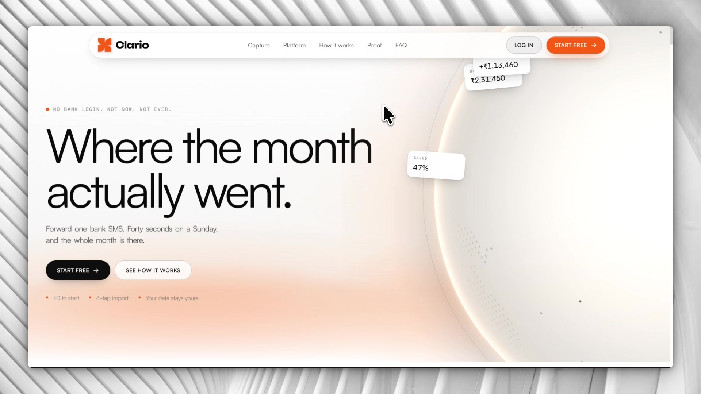
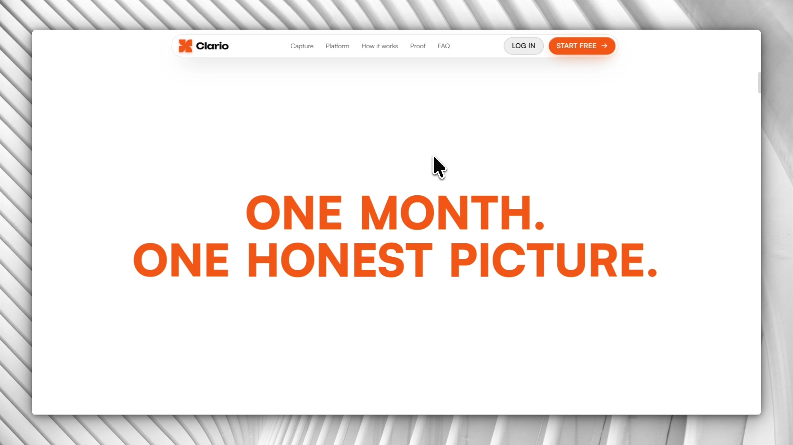
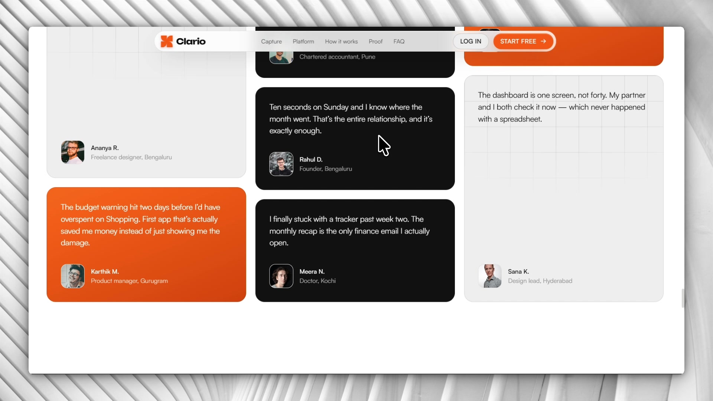
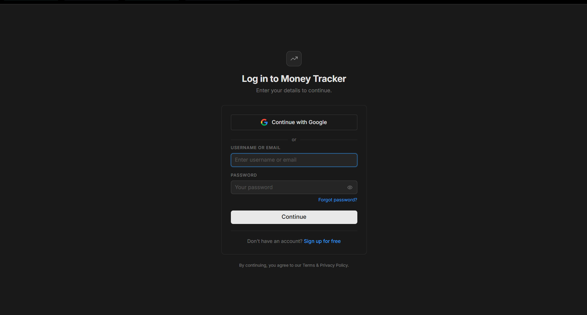
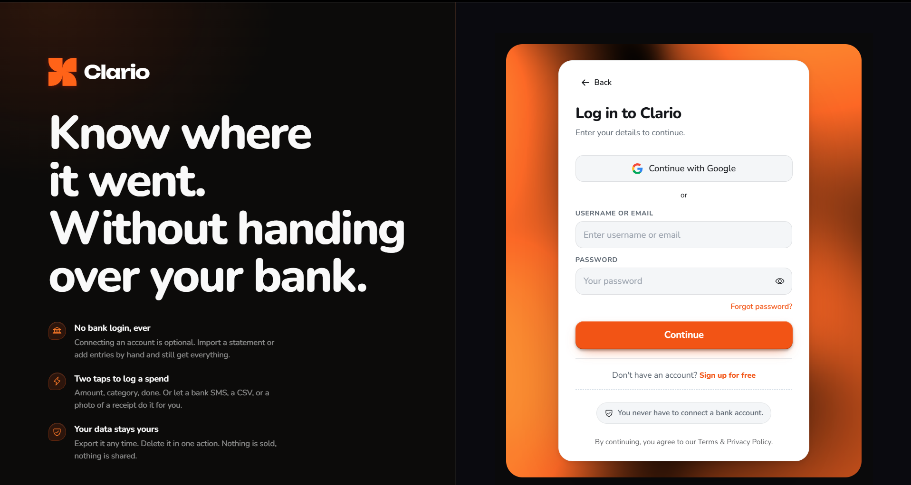
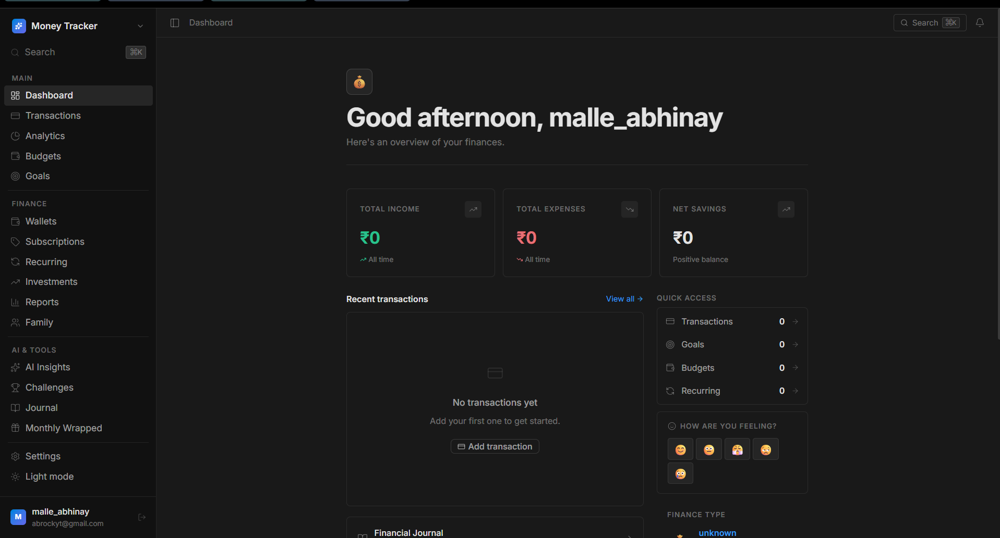
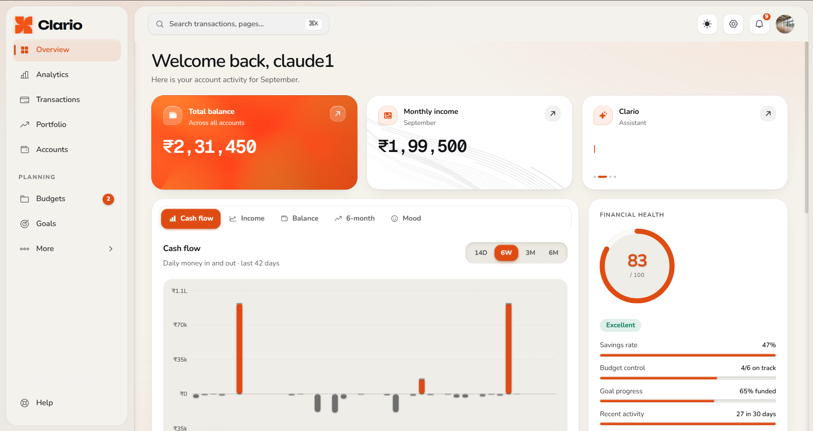
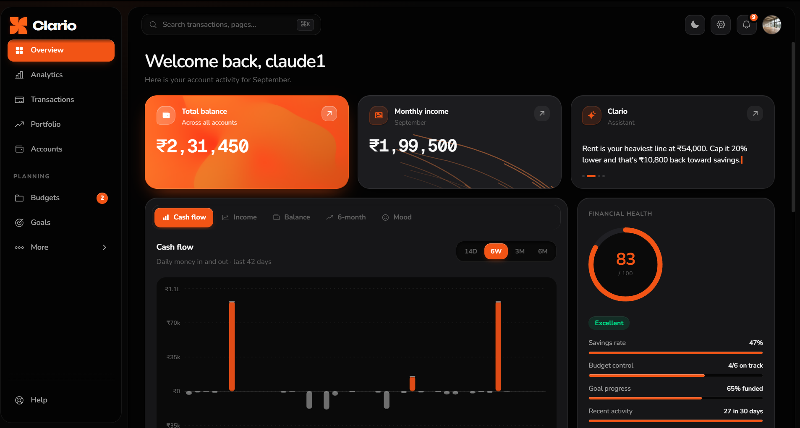

<div align="center">

<h1>💸 Personal Finance Tracker</h1>

<p><strong>A full-stack, production-grade personal finance platform — AI chat, SMS auto-import, investment portfolio, family finance, mood tracking, spending challenges, and a beautiful Notion-inspired UI. Built for India. Works everywhere.</strong></p>

<p>
  <a href="https://personal-finance-tracker-jet-delta.vercel.app" target="_blank">
    
  </a>
  <a href="https://github.com/kadiamyeshwanth/Personal-Finance-Tracker/issues">
    
  </a>
  <a href="https://github.com/kadiamyeshwanth/Personal-Finance-Tracker/issues">
    
  </a>
</p>

<br/>


</div>

---

<div align="center">

# 🎨 The Clario Redesign

### UI/UX &nbsp;·&nbsp; Front‑End &nbsp;·&nbsp; Brand

**by [Abhinay](https://github.com/Abhinay) — the design & front‑end half of this project**


</div>

> This half of the repo is a **UI‑only redesign**. Every route, API call, hook and
> feature is byte‑for‑byte the same as what [@kadiamyeshwanth](https://github.com/kadiamyeshwanth)
> shipped — only the pixels, the motion and the affordances changed. The product
> went from **"Money Tracker"** to **Clario**.

---

## 1 · The problem statement

Most people **bounce off finance apps in the first week.** Two reasons, every time:

1. **"Connect your bank"** — a login wall that feels like handing a stranger your keys.
2. **Manual data entry** — a chore that dies the moment life gets busy.

So the tracker that could have helped never gets used, and the person goes back to
guessing where the month went.

**Clario's answer:** you never connect a bank. You forward one bank **SMS**, drop a
**CSV** statement, or snap a **receipt** — the amount, merchant and date are parsed
for you. The whole ritual is *"forty seconds on a Sunday,"* and the month is just
there. The redesign's job was to make the product **look and feel** like that promise:
calm, fast, honest, and never demanding.

---

## 2 · The brand

|  |  |
|---|---|
| **Name** | **Clario** — *clarity*, with a soft, human `‑o`. Short, sayable, own‑able. |
| **Mark** | A rounded four‑blade pinwheel ([`finance-tracker/public/clario.svg`](finance-tracker/public/clario.svg)) — motion + focus, drawn on the same corner radius as the UI. |
| **Wordmark** | Set in **Unbounded** — geometric, confident, a little editorial. |
| **Voice** | Plain sentences. No jargon, no lectures. *"Know where it went. Without handing over your bank."* |

### Why orange?

Every bank app is **blue or green** — trust‑by‑cliché, and cold. Clario is about a
warmer relationship with your own money, so the brand is a single **warm orange**,
used with discipline:

- it reads as **energy and optimism**, not alarm (red) or institution (blue);
- one accent on a mostly **monochrome** UI means the **money figures pop** — colour is reserved for amounts and the primary action, nothing else;
- the exact tone (`#E85002`) stays legible on **both** near‑black and off‑white, so light/dark mode need one variable, not two palettes.

---

## 3 · Before → After

> Old build ("Money Tracker") is still live: **https://personal-finance-tracker-jet-delta.vercel.app**
> Captures live in [`docs/redesign/`](docs/redesign).

### The new landing page

A bleed‑edge silk **sphere hero** that shrinks on scroll · a logo marquee · a
scroll‑driven case slider · a **pinned headline that assembles from scattered
characters** (*"One month. One honest picture."*) · a detailed bento section · a
3‑step "see it move" sequence · big testimonials · a footer globe cresting the edge.



| Capture section | Proof |
|---|---|
|  |  |

### Login — before → after

| Before ("Money Tracker") | After (Clario) |
|---|---|
|  |  |
| One dark card in a black void. Blue links, grey button, a Lucide line‑chart glyph for a logo. | Split screen: the promise on the left, a flat white card on the right, floating on a rounded **ShaderGradient** orange water‑plane. Dark‑only, viewport‑locked, one accent colour. |

### Dashboard — before → after

| Before | After (light) | After (dark) |
|---|---|---|
|  |  |  |
| Flat dark grid, a 💰 emoji for the section icon, blue "View all" links, every figure the same weight. | A **bento** of surfaces — the balance tile carries the brand fill + a subtle shader, "Monthly income" a flowing line texture, an **Ask Clario** assistant card. One switchable charts panel, a **Financial Health** ring, colour only on money. Same layout light or dark. |

### Walkthrough

Full screen‑recording of the redesigned app (54 s, 1080p):

<video src="https://github.com/kadiamyeshwanth/Personal-Finance-Tracker/raw/main/docs/redesign/walkthrough.mp4" controls muted width="900"></video>

<sub>Player not loading? Open it directly: [`docs/redesign/walkthrough.mp4`](docs/redesign/walkthrough.mp4)</sub>

---

## 4 · Design system

### Type

| Role | Family | Why |
|------|--------|-----|
| UI + headings | **Nunito** | Rounded terminals — friendly, never sterile; excellent at small sizes |
| Display / wordmark | **Unbounded** | Geometric character for the brand and big landing type |
| Numbers | **Geist Mono** | Tabular figures so amounts line up and don't jitter while animating |

### Colour — the Clario palette

**Brand**

| | Token | Hex | Use |
|---|---|---|---|
|  | `--brand` | `#E85002` | primary action, links, focus (dark) |
|  | `--brand` (light) | `#D64802` | same, one shade deeper for light‑mode contrast |
|  | `--brand-from` | `#F16001` | gradient / hover start |
|  | `--brand-to` | `#C10801` | gradient end (the login shader, CTA sheen) |

**Surfaces (dark — the primary look)**

| | Hex | Use |
|---|---|---|
|  | `#0E0E0E` | app background |
|  | `#1C1C1C` | cards / panels |
|  | `#141416` | recessed wells, sidebar rail |
|  | `#F9F9F9` | primary text |
|  | `#A7A7A7` | secondary text |
|  | `#646464` | tertiary / captions |

**Surfaces (light)**

| | Hex | Use |
|---|---|---|
|  | `#FFFFFF` | background / cards |
|  | `#F4F2ED` | secondary surface (warm paper, not grey) |
|  | `#101216` | primary text |

**Money — the only other colour, and only on amounts**

| | Hex | Meaning |
|---|---|---|
|  | `#4ade80` / `#0d7a55` | income · positive delta |
|  | `#f43f5e` / `#b8443a` | expense · alert · negative delta |

### Shape & depth

- **Mac‑like radii** — `~16–22px` on cards, full pills on chips and buttons.
- A **skeuomorphic depth pass** (`skeuo.css`): soft inset highlights + layered shadows so panels read as physical objects, not flat rectangles — dialled *just* far enough to feel tactile, not 2010.
- Translucent, blurred chrome (topbar, toasts, the login shader panel) with content sliding underneath.

---

## 5 · Front‑end architecture

**Stack:** React 19 · Vite 7 · plain JSX. No CSS‑in‑JS.

### The CSS cascade (loaded in this order from `main.jsx`)

```
index.css      → design tokens (:root / [data-theme]) + resets + primitives
   ↓
clario.css     → the app: dashboard, tables, forms, charts, nav
   ↓
skeuo.css      → the depth/skeuomorph pass — loads LAST, wins with !important,
                 appended in dated "ROUND N" blocks so changes are auditable
   ↓
prelanding.css → landing-page scaffolding
   ↓
meridian.css   → the marketing page's self-contained `.mr-*` world
```

Plus **Tailwind v4** (`@import 'tailwindcss'` + `@theme inline` mapping shadcn‑style
tokens onto the Clario palette) and **HeroUI** for a handful of headless primitives.
Everything themable through **CSS custom properties** — one `[data-theme]` attribute
on `<html>` flips the whole app; the marketing page pins its own look.

### Notable engineering

- **`useScrollProgress(ref, mode)`** — a scroller‑agnostic scroll hook (`through` / `exit` / `cover`) built on `getBoundingClientRect` + `IntersectionObserver`, because the page uses window scroll and framer's `useScroll` reads 0.
- **View Transitions API** — the light/dark toggle is a circular `clip-path` wipe from the button.
- **Off‑screen pausing** — the WebGL globe and shader canvases stop drawing once scrolled away (IntersectionObserver‑gated) to keep the long landing page smooth.
- Login is **dark‑only, fixed to the viewport**, with a theme‑aware `ShaderGradient` water‑plane behind a flat white card.

---

## 6 · Motion

The brief was **"butter smooth."** Reaches for:

| Library | Where |
|---|---|
| **Framer Motion 12** | every reveal (`whileInView` + variants), scroll‑driven parallax (`useTransform`), spring physics on drags/toasts, `AnimatePresence` exits, layout animations |
| **Lenis 1.3** | page smooth‑scroll — normal wheel speed, position eased every frame (easeOutExpo, timing matched to `trymeridian.com`) so every scroll‑driven transform glides instead of stepping between wheel notches |
| **@shadergradient/react** | WebGL water‑plane behind the login card and accent tiles |
| **cobe** | the interactive globe on the hero and footer |
| **GSAP** | the walking‑crowd canvas on the "who it's for" section |

Signature moments: the **scroll‑gathered headline** (characters thrown out from
centre, converging as you scroll a pinned section, then holding), the
**shrink‑on‑scroll hero + bracket nav**, the **scroll‑driven Work index**, and small
**notification pop‑toasts** that spring from the top and auto‑dismiss.

Everything respects `prefers-reduced-motion`, `prefers-reduced-transparency` and
`prefers-contrast`.

---

## 7 · How the design answers the problem

| The problem | The design move |
|---|---|
| "Connect your bank" feels unsafe | Every surface repeats it, calmly: *"No bank login · No spreadsheet · No lecture."* The login screen itself says *"You never have to connect a bank account."* |
| Data entry is a chore | The four inputs (SMS / CSV / receipt / by hand) are the **hero of the capture section**, each with a live mini‑preview — the effort looks tiny because it is. |
| Trackers overwhelm | The dashboard is **one screen**: three headline figures, one switchable charts panel, recent transactions, a right rail. Colour only on money. |
| People forget to check | The "ten‑second Sunday check" is stated as the *whole* ritual, and the monthly **Wrapped** recap is framed as the one finance email worth opening. |
| It has to feel trustworthy | Craft: real typographic hierarchy, tactile depth, motion that starts from the current value and can be interrupted — nothing janky, because jank reads as carelessness. |

---

## 8 · Timeline — ~1 week

| Days | Work |
|---|---|
| 1 | Research, competitor teardown, brand direction, palette + type, token layer |
| 2–3 | Dashboard rebuild — bento tiles, charts panel, sidebar/topbar, health score, wallets |
| 3–4 | Auth screens, settings, the long‑tail pages (analytics, budgets, goals, journal…) |
| 4–6 | The marketing landing page — hero, silk sphere, scroll sections, bento, testimonials, footer |
| 6–7 | Motion polish, `prefers-*` passes, responsive breakpoints, performance (off‑screen pausing, cascade cleanup), bug‑fix rounds |

---

<div align="center">

*Everything below this line is the original project & backend, by **[Kadiam Yeshwanth](https://github.com/kadiamyeshwanth)** — unchanged.*

</div>

---

## 📖 Table of Contents

- [Overview](#-overview)
- [What's New](#-whats-new)
- [Features](#-features)
- [Tech Stack](#️-tech-stack)
- [Architecture](#-architecture)
- [Getting Started](#-getting-started)
- [Project Structure](#-project-structure)
- [API Reference](#-api-reference)
- [Android App](#-android-sms-companion-app)
- [Deployment](#-deployment)
- [Security](#-security)
- [Contributing](#-contributing)

---

## 🧭 Overview

Personal Finance Tracker is a **fully-featured, production-ready finance management platform** designed for the Indian market. It goes far beyond a simple transaction logger — it is an intelligent financial companion that reads your bank SMS messages, learns your spending personality, coaches you through challenges, lets you journal your financial mindset, and delivers Spotify-Wrapped-style monthly reviews.

Everything runs **without any paid AI API** — all intelligence is local, rule-based, and fast.

---

## 🆕 What's New

> Major feature releases added since initial launch:

| Feature | Description |
|---------|-------------|
| 🤖 **AI Chat Engine** | Natural language financial assistant — ask anything about your money |
| 🔥 **AI Roast Mode** | Brutally honest (and funny) spending commentary based on real data |
| 📈 **Investment Portfolio** | Track stocks, mutual funds, FDs, crypto — with P&L and allocation charts |
| 👨‍👩‍👧 **Family Finance** | Shared group dashboard with invite codes and combined spending view |
| 📱 **SMS Auto-Import** | Native Android companion app auto-imports every UPI/bank SMS in real time |
| 📄 **Bank CSV Import** | Bulk import from HDFC, ICICI, SBI, Axis CSV statements with auto-mapping |
| 📓 **Financial Journal** | Daily journaling linked to actual day's transactions and mood |
| 😊 **Mood Tracker** | Log emotional state daily and discover your mood-spending correlations |
| 🏆 **Spending Challenges** | Gamified no-spend challenges, category limits, and budget streaks |
| 🎬 **Finance Wrapped** | Monthly Spotify-Wrapped style summary with personality title and highlights |
| 🧠 **AI Insights v2** | Spending heatmap, day-of-week patterns, recurring detection, predictions |
| 🏷️ **Custom Categories** | Create, rename, and colorize your own transaction categories |
| 🔔 **Smart Notifications** | Budget alerts, streak achievements, challenge milestones via cron jobs |
| 📊 **Enhanced Reports** | Date-range picker, category drilldowns, and exportable summaries |

---

## ✨ Features

### 💳 Core Finance

- **Transaction Management** — Add, edit, delete, bulk-filter transactions with smart search, sortable columns (date, amount, category, merchant), and multi-tag support
- **Recurring Transactions** — Automate daily, weekly, monthly, and yearly entries via `node-cron` with full CRUD management
- **Wallet / Account Tracking** — Manage multiple accounts (bank, cash, credit card, savings), each with live running balance
- **Subscriptions Tracker** — Monitor active subscriptions with billing cycle awareness (weekly / monthly / yearly), upcoming renewal alerts, and monthly cost roll-up
- **Custom Categories** — Create fully personalized transaction categories with color-coded icons

### 🤖 AI & Intelligence (No OpenAI Required)

- **AI Chat Assistant** — Conversational financial coach powered by a local rule engine. Understands questions about spending, budgets, savings rate, and goals in plain English
- **AI Roast Mode** — Analyzes late-night purchases, impulse buys, top merchants, and savings rate to deliver data-driven humorous commentary on your habits
- **Investment Advisor** — Rule-based risk profiling (Conservative / Moderate / Aggressive) with personalized SIP, PPF, index fund, and emergency fund recommendations
- **Spending Personality Engine** — Automatically classifies you as Saver, Spender, Balanced, or Investor based on transaction patterns
- **Predictive Insights** — Forecasts next month's expenses based on rolling average history
- **Recurring Detection** — Automatically surfaces potential subscriptions hiding in your transaction history

### 📊 Analytics & Reports

- **Live Dashboard** — Real-time financial health score, net savings, income vs. expense trend cards with animated counters
- **Interactive Charts** — Recharts-powered bar, pie, area, and line charts with dark-mode support
- **Spending Heatmap** — Hour-of-day × day-of-week grid revealing exactly when you're most likely to overspend
- **Day-of-Week Patterns** — Discover if you spend 40% more on weekends vs. weekdays
- **Month-over-Month Analysis** — Automatic MoM change percentage with color-coded trend indicators
- **Finance Wrapped** — Monthly Spotify-style personal financial recap: top categories, biggest single transaction, worst spending day/hour, top merchant, dominant mood, personality title, and savings rate badge
- **Advanced Reports** — Custom date range selection, category-level drilldowns, income vs. expense breakdowns

### 📱 SMS Auto-Import

- **Android Companion App** (native Kotlin) — runs silently in the background as a foreground service
- **UPI & Bank SMS Parsing** — Supports HDFC, SBI, ICICI, Axis, Kotak, Paytm, PhonePe, Google Pay, and 20+ other Indian bank sender IDs
- **Intelligent Parsing** — Extracts amount (₹), transaction type (credit/debit), date, and merchant/payee from raw SMS text
- **Webhook-based Architecture** — Token-authenticated private URL per user; no app login required on phone
- **Duplicate Prevention** — Server-side dedup by amount + type + date ± 1 day before inserting
- **Auto-Categorization** — Merchant name fed into the categorizer engine for instant labeling
- **CSV Bank Import** — Upload your bank's CSV statement; supports DD/MM/YYYY, MM-DD-YYYY, YYYY-MM-DD formats; bulk insert up to 1,000 rows per import with partial-success support
- **Receipt Scanner Modal** — Snap a receipt and parse amounts into a new transaction form

### 👨‍👩‍👧 Family Finance

- **Family Groups** — Create or join a shared household finance group with a 6-character invite code
- **Combined Dashboard** — See every member's income, expenses, category breakdowns, and recent transactions in one unified view
- **Privacy-respecting** — Members see combined totals but interact with their own transaction data individually
- **Admin transfer** — Creator role auto-transfers when the original admin leaves the group

### 📓 Journal & Mood

- **Financial Journal** — Write daily entries linked automatically to that day's actual spend and income totals; one entry per day (upsert)
- **Mood Logging** — Track emotional state (😊 😐 😢 😤 🤩) once per day
- **Mood-Spending Correlation** — Discover which emotional state triggers the most spending (e.g. "You spend 3× more when stressed")

### 🏆 Gamification & Challenges

- **Spending Challenges** — Set custom no-spend days, category caps, or savings targets with a start/end date and target amount
- **Streaks** — Daily tracking streak with cron-job-powered automatic streak updates and budget alert notifications
- **Budget Alerts** — Automated cron job fires notifications when you approach or exceed a category budget limit
- **Milestone Notifications** — In-app notification center with bell-icon drawer for budget events, goal completions, and streak achievements

### 📈 Investment Portfolio

- **Multi-asset Tracking** — Add stocks, mutual funds, Fixed Deposits, crypto, gold, PPF, and more
- **Live P&L Dashboard** — Total invested vs. current value, unrealized gain/loss in ₹ and %
- **Allocation Pie Chart** — Visual breakdown of portfolio by asset class
- **Color-coded Entries** — Each investment gets a custom color tag for quick recognition
- **Risk Profile** — Auto-computed profile (Conservative / Moderate-Aggressive) based on monthly surplus

### 🔐 Security & Auth

- **JWT Authentication** — Stateless register/login with configurable token expiry
- **Google OAuth 2.0** — One-click sign-in via Passport.js (no password needed)
- **Forgot Password** — SHA-256 hashed email reset tokens with 1-hour expiry
- **SMS Webhook Token** — Per-user cryptographically random token; regenerate on demand
- **Rate Limiting** — `express-rate-limit` on all auth endpoints
- **Helmet.js** — Full suite of production HTTP security headers
- **bcrypt** — Password hashing with salted rounds

### 📱 Accessibility & UX

- **Fully Mobile Responsive** — Collapsible hamburger sidebar, stacked cards, touch-optimized tables
- **Dark / Light Mode** — System-level theme toggle with persistent `localStorage` preference
- **Command Palette** — Global ⌘K / Ctrl+K search to jump to any page instantly
- **Notification Center** — Bell icon slide-out drawer with categorized alerts
- **Smooth Animations** — Framer Motion page transitions and component micro-animations
- **CSS Breakpoints** — 1024px (tablet), 768px (mobile), 480px (small phone)

---

## 🛠️ Tech Stack

| Layer | Technology |
|-------|-----------|
| **Frontend** | React 18, Vite, React Router v6 |
| **Animations** | Framer Motion |
| **Charts** | Recharts |
| **Data Fetching** | TanStack Query (React Query) |
| **Styling** | Vanilla CSS with design tokens (Notion-inspired dark system) |
| **Backend** | Node.js 18+, Express.js |
| **Database** | MongoDB Atlas, Mongoose ODM |
| **Authentication** | JWT, Passport.js, Google OAuth 2.0 |
| **Email** | Nodemailer (Gmail SMTP / console fallback) |
| **Cron Jobs** | node-cron — recurring transactions, streak updates, budget alerts |
| **Security** | Helmet, express-rate-limit, bcrypt, SHA-256, crypto |
| **File Parsing** | Custom CSV parser (multi-format Indian bank support) |
| **SMS Parsing** | Custom regex engine — 20+ Indian bank sender IDs |
| **Android App** | Kotlin, Android Foreground Service, BroadcastReceiver |
| **Frontend Host** | Vercel (auto-deploy on push to `main`) |
| **Backend Host** | Railway (always-on, no cold starts) |
| **Database Host** | MongoDB Atlas M0 (free tier) |

---

## 🏗️ Architecture

```
┌─────────────────────────────────────────────────────────────────┐
│                        CLIENT LAYER                             │
│  ┌──────────────────┐          ┌────────────────────────────┐   │
│  │  React 18 + Vite │          │  Android Kotlin App        │   │
│  │  (Vercel CDN)    │          │  (Background SMS Forwarder)│   │
│  └────────┬─────────┘          └──────────────┬─────────────┘   │
│           │ HTTPS REST API                    │ Webhook POST     │
└───────────┼───────────────────────────────────┼─────────────────┘
            │                                   │
┌───────────▼───────────────────────────────────▼─────────────────┐
│                    EXPRESS.JS API SERVER                        │
│                      (Railway — Always On)                      │
│                                                                 │
│  Auth ─── Transactions ─── AI ─── Insights ─── Wrapped         │
│  SMS  ─── Import      ─── Family ─ Investments ─ Journal       │
│  Mood ─── Streaks     ─── Notifications ─── Categories         │
│                                                                 │
│  ┌─────────────┐  ┌─────────────┐  ┌───────────────────────┐   │
│  │  node-cron  │  │  Passport   │  │  Categorizer Engine   │   │
│  │  Jobs       │  │  (OAuth)    │  │  (Rule-based AI)      │   │
│  └─────────────┘  └─────────────┘  └───────────────────────┘   │
└─────────────────────────────┬───────────────────────────────────┘
                              │ Mongoose ODM
┌─────────────────────────────▼───────────────────────────────────┐
│                      MongoDB Atlas                              │
│                                                                 │
│  Users · Transactions · Budgets · Goals · Wallets              │
│  Subscriptions · Investments · Family · Categories             │
│  JournalEntries · MoodLogs · Streaks · Notifications           │
└─────────────────────────────────────────────────────────────────┘
```

---

## 🚀 Getting Started

### Prerequisites

- **Node.js** v18+
- **MongoDB** (local instance or MongoDB Atlas free tier)
- **Git**
- A **Google Cloud project** with OAuth 2.0 credentials *(optional, for Google sign-in)*
- **Android Studio** *(optional, to build the SMS companion APK)*

---

### 1. Clone the Repository

```bash
git clone https://github.com/kadiamyeshwanth/Personal-Finance-Tracker.git
cd Personal-Finance-Tracker
```

---

### 2. Backend Setup

```bash
cd finance-tracker-backend
npm install
```

Create a `.env` file inside `finance-tracker-backend/`:

```env
# ── Database ────────────────────────────────────────
MONGODB_URI=mongodb://localhost:27017/money_tracker_db

# ── Server ──────────────────────────────────────────
PORT=5000
CORS_ORIGIN=http://localhost:5173

# ── JWT ─────────────────────────────────────────────
JWT_SECRET=change_this_to_a_long_random_string
JWT_EXPIRES_IN=7d

# ── URLs ────────────────────────────────────────────
FRONTEND_URL=http://localhost:5173
BACKEND_URL=http://localhost:5000

# ── Google OAuth (optional) ─────────────────────────
GOOGLE_CLIENT_ID=your_google_client_id
GOOGLE_CLIENT_SECRET=your_google_client_secret

# ── Email / Password Reset (optional) ───────────────
# If not set, reset links are printed to the console
EMAIL_USER=your_gmail@gmail.com
EMAIL_PASS=your_gmail_app_password
```

Start the backend:

```bash
node server.js
# Server running on http://localhost:5000
```

---

### 3. Frontend Setup

```bash
cd finance-tracker
npm install
npm run dev
# App available at http://localhost:5173
```

---

### 4. Android SMS App (Optional)

> Required only if you want automatic UPI/bank SMS import on your phone.

1. Open **Android Studio** → Open project → select `sms-tracker-android/`
2. Wait for Gradle sync (~2 min on first run)
3. **Build → Build Bundle(s)/APK(s) → Build APK(s)**
4. APK will be at `app/build/outputs/apk/release/app-release.apk`
5. Transfer to your Android phone, enable "Install from unknown sources", and install
6. Open the app → paste your **webhook URL** from `Settings → SMS Auto-Import` → tap **Activate**
7. Every UPI/bank SMS now auto-imports into your dashboard within seconds 🎉

---

## 📁 Project Structure

```
Personal-Finance-Tracker/
│
├── finance-tracker/                      # React + Vite frontend
│   └── src/
│       ├── api/                          # Axios API client functions
│       │   ├── ai.js                     # AI chat, roast, investment advice
│       │   ├── categories.js             # Custom categories
│       │   ├── insights.js               # Heatmap, patterns, predictions
│       │   ├── investments.js            # Portfolio CRUD
│       │   ├── journal.js                # Journal entries
│       │   ├── mood.js                   # Mood logs & correlation
│       │   ├── notifications.js          # In-app notifications
│       │   ├── streaks.js                # Streak data
│       │   └── wrapped.js                # Monthly Wrapped
│       │
│       ├── components/
│       │   ├── layout/
│       │   │   ├── AppLayout.jsx         # Root layout shell
│       │   │   ├── Sidebar.jsx           # Navigation sidebar
│       │   │   └── TopBar / PageHeader   # Top bar & breadcrumbs
│       │   └── ui/
│       │       ├── NotificationPanel.jsx # Bell icon drawer
│       │       ├── CSVImportModal.jsx    # Bank CSV import wizard
│       │       ├── SMSImportModal.jsx    # SMS webhook setup guide
│       │       └── ReceiptScannerModal.jsx
│       │
│       └── pages/
│           ├── DashboardPage.jsx         # Main dashboard with KPI cards
│           ├── TransactionsPage.jsx      # Transaction table + filters
│           ├── BudgetsPage.jsx           # Budget management
│           ├── GoalsPage.jsx             # Savings goals tracker
│           ├── AnalyticsPage.jsx         # Charts and spending trends
│           ├── AIInsightsPage.jsx        # AI chat + roast + insights
│           ├── InvestmentsPage.jsx       # Investment portfolio
│           ├── FamilyPage.jsx            # Family group dashboard
│           ├── JournalPage.jsx           # Financial journal
│           ├── SpendingChallengesPage.jsx # Gamified challenges
│           ├── WrappedPage.jsx           # Monthly Finance Wrapped
│           ├── ReportsPage.jsx           # Advanced reports
│           ├── SettingsPage.jsx          # Profile, SMS setup, preferences
│           ├── LoginPage.jsx             # Login / Register / OAuth
│           ├── RecurringPage.jsx         # Recurring transaction manager
│           ├── SubscriptionsPage.jsx     # Subscription tracker
│           └── WalletsPage.jsx           # Multi-account wallet manager
│
├── finance-tracker-backend/             # Node.js + Express API
│   ├── config/
│   │   └── passport.js                  # Google OAuth 2.0 strategy
│   ├── cron/
│   │   ├── recurringJob.js              # Auto-creates recurring transactions
│   │   ├── streakJob.js                 # Daily streak updater
│   │   └── budgetAlertJob.js            # Budget threshold notification sender
│   ├── middleware/
│   │   ├── protect.js                   # JWT authentication middleware
│   │   └── validate.js                  # Request validation middleware
│   ├── models/
│   │   ├── User.js                      # User + smsWebhookToken field
│   │   ├── Transaction.js               # Core transaction schema
│   │   ├── Budget.js, Goal.js           # Budget & goal schemas
│   │   ├── Wallet.js, Subscription.js   # Wallet & subscription schemas
│   │   ├── Investment.js                # Investment portfolio schema
│   │   ├── Family.js                    # Family group schema
│   │   ├── Category.js                  # Custom category schema
│   │   ├── JournalEntry.js              # Daily journal schema
│   │   ├── MoodLog.js                   # Mood tracking schema
│   │   ├── Streak.js                    # Streak tracking schema
│   │   └── Notification.js              # In-app notification schema
│   ├── routes/
│   │   ├── auth.js                      # Login, register, OAuth, password reset
│   │   ├── transactions.js              # CRUD + search + bulk operations
│   │   ├── ai.js                        # AI chat, roast, investment advice
│   │   ├── insights.js                  # Heatmap, patterns, predictions, suggest-category
│   │   ├── wrapped.js                   # Monthly Finance Wrapped endpoint
│   │   ├── sms.js                       # SMS webhook, setup, token regen, history
│   │   ├── import.js                    # Bank CSV bulk importer
│   │   ├── investments.js               # Investment portfolio CRUD
│   │   ├── family.js                    # Family group create/join/dashboard/leave
│   │   ├── journal.js                   # Journal CRUD (upsert per day)
│   │   ├── mood.js                      # Mood log + spending correlation
│   │   ├── streaks.js                   # Streak fetch
│   │   ├── notifications.js             # Notification CRUD
│   │   ├── categories.js                # Custom category CRUD
│   │   ├── budgets.js, goals.js         # Budget & goals CRUD
│   │   ├── wallets.js, subscriptions.js # Wallet & subscription CRUD
│   │   └── users.js                     # Profile management
│   └── utils/
│       ├── categorizer.js               # Merchant → category rule engine
│       ├── chatEngine.js                # Local AI conversational engine
│       ├── personalityEngine.js         # Spending personality + predictions
│       ├── fraudDetector.js             # Anomaly / suspicious transaction flags
│       └── mailer.js                    # Nodemailer SMTP wrapper
│
├── sms-tracker-android/                 # Native Android companion app (Kotlin)
│   └── app/src/main/java/
│       └── com/financetracker/smsforwarder/
│           ├── MainActivity.kt          # App UI & webhook URL input
│           ├── SmsReceiver.kt           # BroadcastReceiver for incoming SMS
│           ├── SmsWebhookSender.kt      # HTTP POST to backend webhook
│           ├── BootReceiver.kt          # Auto-starts service on device reboot
│           └── TrackerForegroundService.kt # Persistent background service
│
├── render.yaml                          # Render deployment blueprint
└── README.md
```

---

## 📡 API Reference

All protected routes require `Authorization: Bearer <token>` header.

### Authentication
| Method | Endpoint | Description |
|--------|----------|-------------|
| `POST` | `/api/auth/register` | Create new account |
| `POST` | `/api/auth/login` | Login with email + password |
| `GET` | `/api/auth/google` | Initiate Google OAuth |
| `POST` | `/api/auth/forgot-password` | Send password reset email |
| `POST` | `/api/auth/reset-password/:token` | Reset password with token |

### Transactions
| Method | Endpoint | Description |
|--------|----------|-------------|
| `GET` | `/api/transactions` | List transactions (paginated, filterable) |
| `POST` | `/api/transactions` | Create transaction |
| `PATCH` | `/api/transactions/:id` | Update transaction |
| `DELETE` | `/api/transactions/:id` | Delete transaction |

### AI & Insights
| Method | Endpoint | Description |
|--------|----------|-------------|
| `POST` | `/api/ai/chat` | Natural language financial Q&A |
| `POST` | `/api/ai/roast` | Spending roast based on your data |
| `GET` | `/api/ai/investment-advice` | Rule-based investment recommendations |
| `GET` | `/api/insights/personality` | Spending personality type |
| `GET` | `/api/insights/predictions` | Next month expense forecast |
| `GET` | `/api/insights/spending-patterns` | Day-of-week + MoM patterns |
| `GET` | `/api/insights/heatmap` | Hour × day spending heatmap grid |
| `GET` | `/api/insights/recurring-suggestions` | Detected recurring payments |
| `POST` | `/api/insights/suggest-category` | Auto-categorize by merchant name |

### SMS Auto-Import
| Method | Endpoint | Description |
|--------|----------|-------------|
| `POST` | `/api/sms/webhook/:token` | Public SMS webhook (no JWT, token-auth) |
| `GET` | `/api/sms/setup` | Get / auto-generate webhook URL |
| `POST` | `/api/sms/token/regenerate` | Rotate webhook token |
| `GET` | `/api/sms/history` | Last 30 SMS-imported transactions |
| `POST` | `/api/import/csv` | Bulk import from bank CSV (up to 1,000 rows) |

### Family Finance
| Method | Endpoint | Description |
|--------|----------|-------------|
| `POST` | `/api/family/create` | Create a family group |
| `POST` | `/api/family/join` | Join via invite code |
| `GET` | `/api/family` | Get your family group info |
| `GET` | `/api/family/dashboard` | Combined family spending dashboard |
| `DELETE` | `/api/family/leave` | Leave the group |

### Other Modules
| Method | Endpoint | Description |
|--------|----------|-------------|
| `GET/POST/DELETE` | `/api/investments` | Investment portfolio CRUD |
| `GET/POST/DELETE` | `/api/journal` | Financial journal entries |
| `GET/POST` | `/api/mood` | Mood log CRUD |
| `GET` | `/api/mood/correlation` | Mood vs. spending correlation |
| `GET` | `/api/wrapped` | Monthly Finance Wrapped |
| `GET` | `/api/streaks` | Current streak data |
| `GET/POST/DELETE` | `/api/notifications` | In-app notifications |
| `GET/POST/DELETE` | `/api/categories` | Custom category management |
| `GET/POST/DELETE` | `/api/budgets` | Budget CRUD |
| `GET/POST/DELETE` | `/api/goals` | Savings goal CRUD |
| `GET/POST/DELETE` | `/api/wallets` | Multi-wallet CRUD |
| `GET/POST/DELETE` | `/api/subscriptions` | Subscription CRUD |

---

## 📱 Android SMS Companion App

The `sms-tracker-android/` folder contains a **native Android app** (written in Kotlin) that enables true zero-effort transaction tracking.

### How It Works

```
Bank SMS arrives → SmsReceiver (BroadcastReceiver)
                        ↓
               SmsWebhookSender sends POST to
               https://your-backend/api/sms/webhook/<token>
                        ↓
               Server parses SMS → auto-categorizes → saves transaction
                        ↓
               Appears on your dashboard within seconds
```

### Key Components

| File | Role |
|------|------|
| `MainActivity.kt` | Setup UI — paste webhook URL, activate/deactivate |
| `SmsReceiver.kt` | Listens for `android.provider.Telephony.SMS_RECEIVED` |
| `SmsWebhookSender.kt` | HTTP POST with full SMS payload to backend |
| `BootReceiver.kt` | Re-registers receiver after device reboot |
| `TrackerForegroundService.kt` | Keeps the service alive in background (Android 8+) |

### Supported Banks & Payment Apps

HDFC · SBI · ICICI · Axis · Kotak · PNB · Bank of India · Canara Bank · Union Bank · IDBI · Yes Bank · Paytm · PhonePe · Google Pay · Amazon Pay · Airtel Payments Bank · Jio Payments Bank · Baroda Bank · Central Bank · and more via pattern matching.

---

## 🌐 Deployment

| Service | Platform | Details |
|---------|----------|---------|
| Frontend | **Vercel** | Auto-deploys on every `git push` to `main` |
| Backend | **Railway** | Always-on Node.js server, no cold starts |
| Database | **MongoDB Atlas** | M0 free tier cluster |

### Environment Variables

**Backend (Railway / any Node host):**

| Variable | Required | Description |
|----------|----------|-------------|
| `MONGODB_URI` | ✅ | MongoDB Atlas connection string |
| `JWT_SECRET` | ✅ | Long random string for signing JWTs |
| `FRONTEND_URL` | ✅ | Your Vercel frontend URL |
| `CORS_ORIGIN` | ✅ | Your Vercel frontend URL |
| `BACKEND_URL` | ✅ | Your Railway backend URL (used in SMS webhook URL) |
| `GOOGLE_CLIENT_ID` | ⬜ | Google Cloud Console OAuth client ID |
| `GOOGLE_CLIENT_SECRET` | ⬜ | Google Cloud Console OAuth client secret |
| `EMAIL_USER` | ⬜ | Gmail address for password reset emails |
| `EMAIL_PASS` | ⬜ | Gmail App Password |

**Frontend (Vercel):**

| Variable | Required | Description |
|----------|----------|-------------|
| `VITE_API_URL` | ✅ | Your Railway backend URL + `/api` |

---

## 🔑 Google OAuth Setup

1. Go to [Google Cloud Console](https://console.cloud.google.com)
2. Create a project → **APIs & Services → Credentials**
3. Configure OAuth consent screen (External)
4. Create an **OAuth 2.0 Client ID** (Web application)
5. Add Authorized redirect URI:
   ```
   https://your-backend.railway.app/api/auth/google/callback
   ```
6. Copy `GOOGLE_CLIENT_ID` and `GOOGLE_CLIENT_SECRET` into your backend `.env`

---

## 🔐 Security

| Concern | Implementation |
|---------|---------------|
| Password storage | `bcrypt` with salt rounds |
| API authentication | Signed JWT with configurable expiry |
| Google OAuth | Passport.js `passport-google-oauth20` strategy |
| Password reset | SHA-256 hashed token + 1-hour TTL in DB |
| SMS webhook | Per-user cryptographic random token (48 hex chars); rotatable |
| API security headers | `helmet` (XSS, CSRF, clickjacking, HSTS, etc.) |
| Rate limiting | `express-rate-limit` on auth routes |
| Secrets | `.env` file — never committed to Git (excluded via `.gitignore`) |

---

## 👥 Contributions

| Area | Owner |
|------|-------|
| **Product · Backend · API · Database · Auth · SMS pipeline · Deployment** | **[Kadiam Yeshwanth](https://github.com/kadiamyeshwanth)** — built the entire full‑stack platform and shipped it |
| **UI/UX · Front‑end · Brand ("Clario") · Design system · Motion** | **[Abhinay](https://github.com/Abhinay)** — the redesign documented at the top of this README; UI‑only, backend untouched |

> The backend in this fork is intentionally **identical** to the deployed version —
> the redesign changed only what you see, never how it works.

---

## 🤝 Contributing

Contributions, issues, and feature requests are always welcome!

1. **Fork** the repository
2. Create your feature branch:
   ```bash
   git checkout -b feature/your-amazing-feature
   ```
3. Commit your changes with a clear message:
   ```bash
   git commit -m "feat(module): add amazing feature"
   ```
4. Push to your branch:
   ```bash
   git push origin feature/your-amazing-feature
   ```
5. Open a **Pull Request** against `main`

Please follow the [Conventional Commits](https://www.conventionalcommits.org/) format (`feat:`, `fix:`, `refactor:`, `docs:`, etc.) for commit messages.

---

## 📄 License

Distributed under the **MIT License**. See [`LICENSE`](./LICENSE) for details.

---

<div align="center">

**Built with ❤️ by [Kadiam Yeshwanth](https://github.com/kadiamyeshwanth)**

*Full-stack developer passionate about building tools that make everyday life simpler.*

<br/>

⭐ **Star this repo** if you found it useful — it helps others discover the project!

<br/>


</div>
